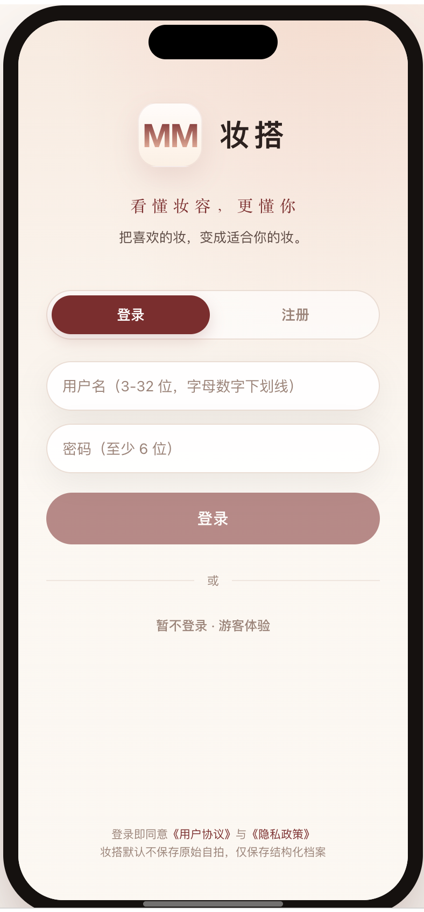
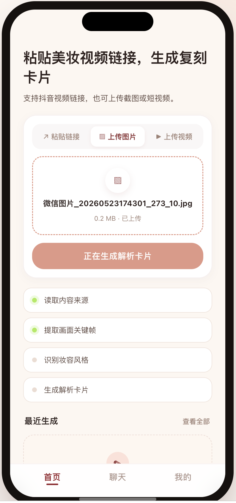
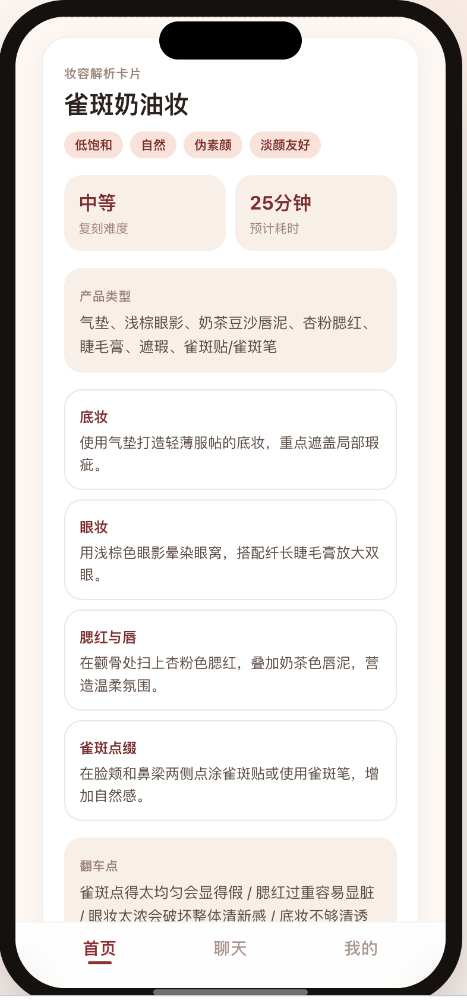
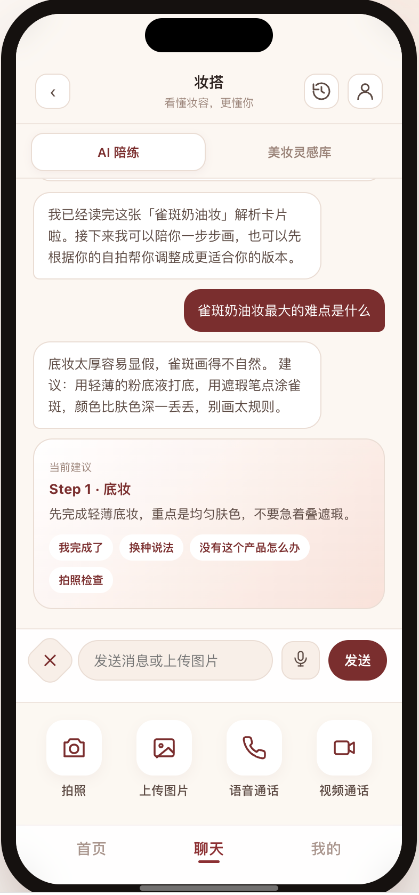
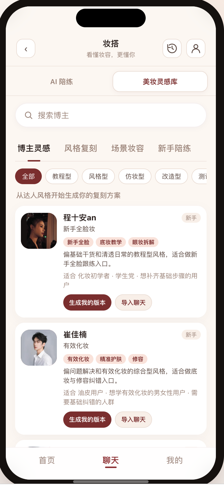
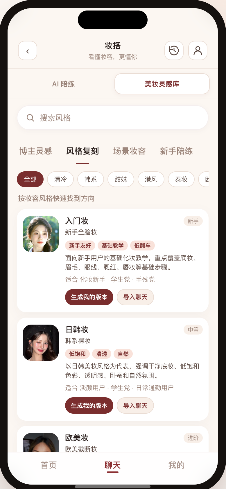

# 妆搭 Makeup Mate

> **会记住你的 AI 美妆复刻陪练**
> 看懂妆容，更懂你 —— 把喜欢的妆，变成适合你的妆。

<p align="center">
  
</p>

<p align="center">
  <em>2026 黑客松作品 · 产品形态：H5 / PWA</em>
</p>

---

## 一句话介绍

刷到一个好看的妆，到底要怎么画到自己脸上？

**妆搭 Makeup Mate** 把这个断点闭合：用户在首页粘贴抖音美妆视频链接、上传妆容图片或本地短视频，AI 自动拆解出**步骤、产品类型、预计耗时、翻车点**，生成一张可分享、可导入聊天的「妆容解析卡片」；进入聊天页后，AI 化身陪练搭子，用文字 / 语音 / 拍照 / 视频陪你一步步完成上妆；每一次复刻都会沉淀到「我的妆容档案」—— **用得越多，越懂你**。

不是又一个修图工具，也不是虚拟试妆，**而是把短视频拆给用户看，再陪用户画完。**

---

## 解决了什么问题

抖音、小红书已经沉淀了海量美妆教程，但**消费内容 ≠ 复刻得了内容**：

| 用户行为 | 现实结果 |
| --- | --- |
| 看完视频很心动 | 收藏夹里多了一条 |
| 想复刻 | 反复暂停、记不住产品名、看不出哪一步是关键 |
| 真动手画 | 找不到对应产品、不知道顺序、卡在某一步 |
| 画完发现 | 不像、显凶、显脏，最后涂掉 |

**美妆视频成了内容消费，不是可执行方案。** 妆搭面向「想画但不专业」的新手、学生党、上班族，把视频内容变成可执行卡片，再用 AI 陪练完成上妆。

---

## 核心功能

### 1. 首页 · 解析入口

**把一个美妆内容来源，变成一张可执行的妆容解析卡片。**

三种入口：上传图片 / 上传视频 / 粘贴链接 → AI 走 4 步流程：读取内容 → 提取关键帧 → 识别风格 → 生成卡片。



生成的妆容解析卡片包含：妆容名称、风格标签、复刻难度、预计耗时、产品类型清单、分步骤拆解、翻车点提示。**可分享、可导入聊天**。



### 2. 聊天页 · AI 陪练 + 美妆灵感库

**AI 陪练**：基于妆容卡片陪你一步步画完，支持文字 / 语音 / 拍照 / 视频通话，遇到卡点可以「换种说法」「找替代产品」「拍照检查」。



**美妆灵感库**：没有明确想画的视频时，从四个入口探索 —— 博主灵感（12 位博主）/ 风格复刻（8 大风格）/ 场景妆容（通勤、约会、面试等）/ 新手陪练。支持搜索 + 多维筛选。

<p>
  
  &nbsp;
  
</p>

### 3. 我的页 · 个人妆容档案

用户的**长期美妆记忆**，工作台风格：

- **面容密码**：脸型、五官风格、眼型、修饰重点、肤色特征
- **色彩标签**：适合唇色 / 腮红 / 眼影，实色色块所见即所得
- **MM 记住的事**：「不喜欢浓眼妆」「上班 15 分钟内」「眼线只画后半段」……
- **建议避开**：重修容、欧美挑眉、过长上挑眼线
- **历史复刻**：小圆点时间线
- **隐私控制**：仅本次分析 / 删除分析记录 / 清空妆容记忆

---

## 差异化定位

| 维度 | 传统产品 | 妆搭 Makeup Mate |
| --- | --- | --- |
| 核心对象 | 图片、人脸、商品色号 | 美妆视频、达人风格、场景妆容 |
| 用户动作 | 修图、试色、测肤 | 粘贴链接 / 跟着 AI 上妆 |
| AI 角色 | 修图工具、识别工具、导购工具 | 内容拆解员、个人化妆师、陪练搭子 |
| 输出 | 精修图、试妆图、商品推荐 | 妆容解析卡片、个性化步骤、陪伴记录 |
| 长期价值 | 模板复用 | 记住妆容档案与偏好，**越用越懂你** |

不与美图、醒图竞争「谁修图更自然」，不与 AR 试妆工具竞争「谁试色更逼真」。妆搭建立的是新的产品心智：**AI 美妆视频复刻陪练。**

---

## 技术架构

| 层 | 技术选型 |
| --- | --- |
| **前端** | Vite · React 18 · TypeScript · CSS Modules |
| **后端** | FastAPI · SQLAlchemy · Pydantic v2 |
| **数据库** | PostgreSQL · 阿里云 OSS（媒体资源） |
| **AI 模型** | Qwen-VL-Max-Latest（视觉解析）· Claude（对话陪练 / 风格改写） |
| **部署** | Docker · uvicorn |

**关键技术点**

- **视频/图片解析**：Qwen-VL 输入关键帧，输出结构化妆容标签 + 步骤 + 产品 + 翻车点
- **聊天上下文**：最近 10 轮对话 + 当前妆容卡片一起喂给模型，避免失忆
- **个性化改写**：用户档案（脸型、肤色、偏好）作为 system prompt 注入，输出「我的版本」
- **响应式适配**：桌面端展示手机外框，移动端全屏铺满，适配 iPhone 刘海 + Android safe-area
- **PWA 支持**：添加到主屏可全屏体验

---

## 工程结构

```text
Makeup-Mate/
├── frontend/         Vite + React + TypeScript
├── backend/          FastAPI + SQLAlchemy + Pydantic v2
├── docs/             开发规格文档
├── design.md         视觉规范（奶油粉调）
├── prd.md            产品需求文档
├── 项目介绍.md       完整产品介绍
└── picture/          产品截图
```

---

## 本地运行

### 后端

```bash
cd backend
python3 -m venv .venv
source .venv/bin/activate
pip install -r requirements.txt
cp .env.example .env
uvicorn app.main:app --reload --port 8000
```

- Swagger 文档：http://localhost:8000/docs

### 前端

```bash
cd frontend
npm install
npm run dev
```

- 开发地址：http://localhost:5173
- Vite 已配置 `/api` → `http://localhost:8000` 代理

---

## 产品边界与隐私

**V1 不做**：颜值评分 / 医疗诊断 / 容貌评价 / 强商品导购 / 大而全社区 / 人脸识别身份认证

**隐私原则**：

1. 默认不保存原始自拍和视频
2. 只保存用户授权后的**结构化妆容档案**
3. 用户可选择「仅本次分析」
4. 用户可随时删除档案和历史记录
5. 不做人脸识别登录、不建立人脸库
6. 不输出颜值评分和容貌羞辱内容

---

## 想看更多

- [完整产品介绍](项目介绍.md) —— 市场分析、竞品对比、产品全貌
- [产品需求文档 PRD](prd.md) —— 详细功能与交互规格
- [视觉规范](design.md) —— 奶油白底 + 奶茶粉 + 勃艮第酒红
- [技术路线底稿](plan1.md) —— 架构与实施思路

---

<p align="center">
  <em>妆搭 Makeup Mate · 看懂妆容，更懂你</em>
  <br/>
  <em>2026 黑客松作品</em>
</p>
